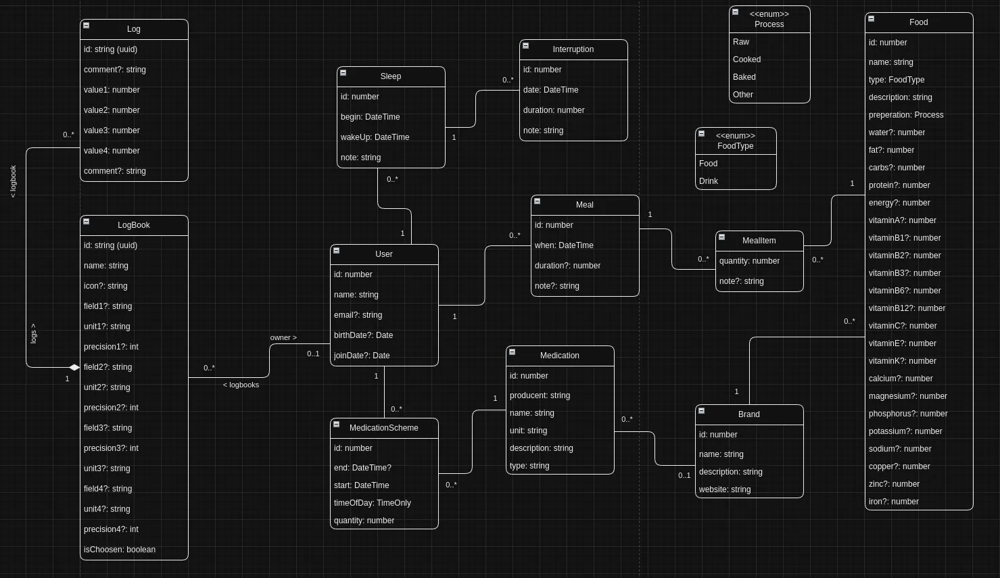

# MedikoJs

## Description

Mediko-JS is a solution te help users store and analyze health data (body parameters, diet, medications schema).

## Design

### Architecture

Mediko is a client-server app which can work offline as a stand-alone desktop application thanks to [Electron JS](https://www.electronjs.org/) framework. Can also be published online as a SPA Web-App or even as a mobile app using [Cordova](https://cordova.apache.org) development framework. Naturally, using same source code. Data will be saved in local storage (web browser or electron desktop) as long as cache will not be cleared. User can register an account to sync locally saved data with the server.

### Server

On the server side we have a [NestJs](https://nestjs.com/) backend with [MySQL](https://www.mysql.com/)/[MariaDb](https://mariadb.org/) database + [TypeORM](https://typeorm.io/) following Repository Pattern.

### Client

Client is a [Vue.Js](https://vuejs.org/) based [Quasar](https://quasar.dev/) application.

### Language

Both client & server are written in [TypeScript](https://www.typescriptlang.org/).

## Domain

Backend domain is described by the diagram below:

